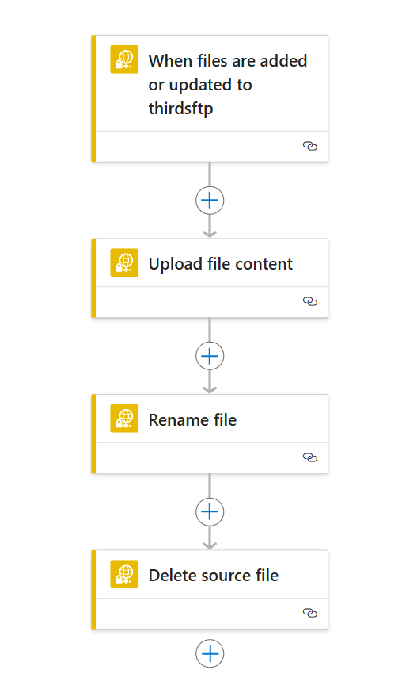
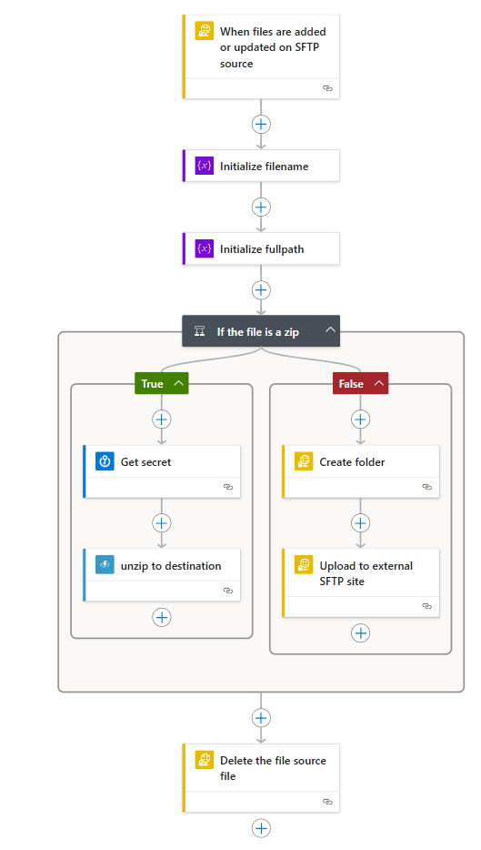

# Logic App Demonstrations
A series of logic app demos that deal with files in SFTP servers and blob storage accounts

## Scheduled Copy
This logic app uses a recurrance step to trigger the workflow at an interval (10 minutes) and to then take files from a source and copy to a folder in the destination (using the current date and time to form part of the folder name) and finally to then set the destination blobs to *archived* status.

## Mirror Files
This is a simple triggered workflow that listens to an SFTP folder and when files arrive, copy them to another SFTP site, renaming them with a suffix and then deleting the source file.

## Process Files
This is another SFTP triggered workflow that listens to an SFTP site and when triggered, look to see if the file is a zip. If the file is a zip, it uses an Azure Function to decrypt and extract the files to the destination (using a key held in key vault). If the file is not a zip, it just copies it. In either path, it finally deletes the source file.

