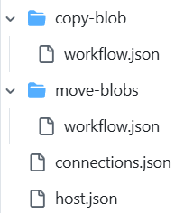
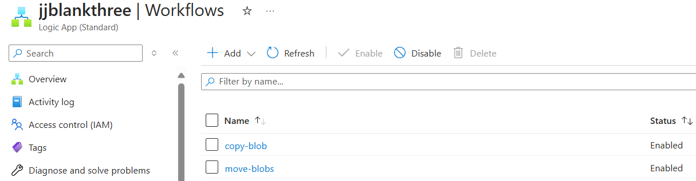

# Automated Deployments
There is currently not much quality information on how to deploy workflows to Logic Apps Standard.

Logic Apps Standard is built on the Azure Functions runtime and unlike Logic Apps Consumption, there can be any number of *workflows* for one Logic App Standard. 

A comparison of these two versions is [here](https://learn.microsoft.com/en-us/azure/logic-apps/single-tenant-overview-compare).

Like Azure Functions, the best deployment approach for these is to:

1. Deploy the Logic App Standard infrastructure
2. Deploy each workflow separately from the infrastructure as the rate of change of these is much higher than the infrastructure.

For a Logic App that has multiple workflows, you can make the decision to deploy all of the workflows in one go or each workflow separately. This is very much akin to Azure Functions an aligns with a (micro) services approach as opposed to a monolith deployment approach.

## Steps to Deployment
In general, this is going to be:
1. Infrastructure
2. Workflows

# Infrastructure Deployment
There are many routes to this:
1. CLI
2. Developer CLI (azd)
3. ARM template
4. Bicep
5. Terraform.

It is best to align this with the overall approach that is other use on adjacent projects or organisational standards for most skills reuse.

This is how a Logic Apps Standard may be deployed using [Bicep](https://learn.microsoft.com/en-us/azure/azure-resource-manager/bicep/overview?tabs=bicep)

There are broadly-speaking 4 main components:
1. the Logic App itself
2. the server farm on which the Logic App is deployed (this may be shared)
3. A storage account for state management
4. Optionally Application Insights

Some sample bicep

the [server farm](https://learn.microsoft.com/en-us/azure/templates/microsoft.web/serverfarms?pivots=deployment-language-bicep) example
```
 resource serverfarms_ASP_towerhamletsrg_97bc_name_resource 'Microsoft.Web/serverfarms@2024-04-01' = {
  name: serverfarms_ASP_towerhamletsrg_97bc_name
  location: 'UK South'
  sku: {
    name: 'WS1'
    tier: 'WorkflowStandard'
    size: 'WS1'
    family: 'WS'
    capacity: 1
  }
  kind: 'elastic'
  properties: {
    perSiteScaling: false
    elasticScaleEnabled: true
    maximumElasticWorkerCount: 20
    isSpot: false
    reserved: false
    isXenon: false
    hyperV: false
    targetWorkerCount: 0
    targetWorkerSizeId: 0
    zoneRedundant: false
  }
}
```

the Logic App
```
resource sites_jjblankthree_name_resource 'Microsoft.Web/sites@2024-04-01' = {
  name: sites_jjblankthree_name
  location: 'UK South'
  kind: 'functionapp,workflowapp'
  identity: {
    type: 'SystemAssigned'
  }
  properties: {
    enabled: true
    hostNameSslStates: [
      {
        name: '${sites_jjblankthree_name}.azurewebsites.net'
        sslState: 'Disabled'
        hostType: 'Standard'
      }
      {
        name: '${sites_jjblankthree_name}.scm.azurewebsites.net'
        sslState: 'Disabled'
        hostType: 'Repository'
      }
    ]
    serverFarmId: serverfarms_ASP_towerhamletsrg_97bc_externalid
    reserved: false
    isXenon: false
    hyperV: false
    dnsConfiguration: {}
    vnetRouteAllEnabled: false
    vnetImagePullEnabled: false
    vnetContentShareEnabled: false
    siteConfig: {
      numberOfWorkers: 1
      acrUseManagedIdentityCreds: false
      alwaysOn: false
      http20Enabled: false
      functionAppScaleLimit: 0
      minimumElasticInstanceCount: 1
    }
    scmSiteAlsoStopped: false
    clientAffinityEnabled: false
    clientCertEnabled: false
    clientCertMode: 'Required'
    hostNamesDisabled: false
    ipMode: 'IPv4'
    vnetBackupRestoreEnabled: false
    customDomainVerificationId: '7C6761218AA3FF18AC28235A2C8C88C2CB16915F3086640269C352A8D052E5CF'
    containerSize: 1536
    dailyMemoryTimeQuota: 0
    httpsOnly: true
    endToEndEncryptionEnabled: false
    redundancyMode: 'None'
    publicNetworkAccess: 'Enabled'
    storageAccountRequired: false
    keyVaultReferenceIdentity: 'SystemAssigned'
  }
}
```

storage for state management:
```
resource logicAppStorage 'Microsoft.Storage/storageAccounts@2023-01-01' = {
  name: logicAppStorageName
  location: location
  kind: 'StorageV2'
  sku: {
    name: storageAccountSku
  }
  properties: {
    allowBlobPublicAccess: false
    accessTier: 'Hot'
    supportsHttpsTrafficOnly: true
    minimumTlsVersion: 'TLS1_2'
  }
}
```

Application Insights
```
 resource applicationInsightsLogicApp 'Microsoft.Insights/components@2020-02-02' = {
  name: 'appinss-${key}-${env}'
  location: location
  kind: 'web'
  properties: {
    Application_Type: 'web'
    Flow_Type: 'Bluefield'
    publicNetworkAccessForIngestion: 'Enabled'
    publicNetworkAccessForQuery: 'Enabled'
    Request_Source: 'rest'
    RetentionInDays: 30
    WorkspaceResourceId: logAnalyticsWorkspacelogicApp.id
  }
}
```

# Workflow Deployment
As the Logic Apps run under the Azure Functions runtime, the Azure Functions deployment mechanisms may be used. These mechanisms are traditionally used for code deployments, but can also deploy the workflow definitions.

## What needs to be deployed
There are three components to a Logic App definition:

1. hosts.json
2. connections.json
3. workflow.json

The hosts file is pretty standard and just defines the runtime and versions that the logic apps run under.

The connections.json contains references to the connections to other services that any of the workflows may need. These work alongside some App Settings which will actually define connection strings to these remote services. For a deployed workflow to work, all of the connections used need to be defined and these connections span all of the workflows for that Logic App.

Each workflow itself needs to be defined in its own *workflow.json* file. Therefore if there are multiple workflows to be deployed, then each of these needs to be in its own folder and each named workflow.json.

## How to deploy
There is already a GitHub Action [zip deploy](https://learn.microsoft.com/en-us/azure/azure-functions/functions-how-to-github-actions?tabs=linux%2Cdotnet&pivots=method-template) for Azure Functions.

This can be used for Logic Apps Standard workflow deployments. In order to use this, a zip file needs to be created that conforms to a standard structure:



Firstly use an action to copy the files to a known place *output* for the zip deploy step:
```
- name: Create project folder
   - name: Create project folder
      run: |
        mkdir output
        cp -r 'workflows' 'output/' # copy all the files, host, connections and all workflows
```

Then the action to zip the above structure needs to be performed:

```
- name: Easy Zip Files
      uses: papeloto/action-zip@v1
      with:
        dest: '${{ github.run_id }}.zip'
        files: output/
```

 this zip file is then used to deploy to the logic app

 ```
    - name: 'Run Azure Functions Action'
      uses: Azure/functions-action@v1
      id: fa
      with:
        app-name: ${{ env.AZURE_FUNCTIONAPP_NAME }}
        package: '${{ github.run_id }}.zip'
```

Once this has been run, the Logic App should have these workflows present.



# Summary and Take-Aways
1. Logic App Standard allows easier separation of infrastructure from workflow deployments
2. Uses the Functions zip deploy
3. The zip that needs to be deployed needs to have a specific structure and must include a host.json and connections.json in the root, together with a folder per workflow (the folder name becomes the workflow name) and each folder must have a worflow.json file.
4. Use an action to copy the right files to an output folder
5. from there zip that up
6. the connections.json contains the names and settings for connections needed in ALL of the workflows
7. the connections in connections.json reference an App Setting that actually has the connection string. This settings needs to be created separately or earlier on in the flow if it does not exist
8. For managed identity connections there are some slight differences


